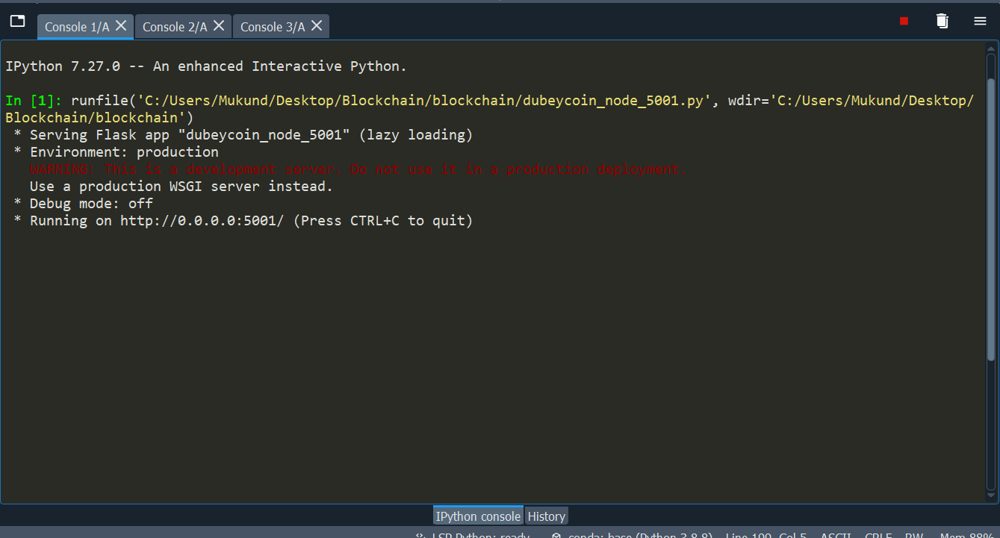

# Dubey-Coin

Dubey-Coin is a decentralized digital currency, without a central bank or single administrator, that can be sent from user to user on the peer-to-peer network without the need for intermediaries.
This project demonstartes working of blockchain technology and mining of cryptocurrency.

## Tech Stack

**Blockchain, Python, Postman, Flask**

  
## Installation Guide

Install __Postman__

```bash
 https://www.postman.com/downloads/
```
Install __Anaconda__
```bash
https://www.anaconda.com/products/individual
```

## Documentation
__**Blockchain.py**__

Contains the structure of a Blockchain. Uses fucntions to create a new block using __create_block__, check chain validity using __is_chain_valid__, mine a block using __mine_block__, and by using SHA256 algorithm generate a unique hash for each block to check __proof_of_work__.

__**Dubeycoin.py**__

Contians the cryptocurrency implementation. Uses 3 additional files __dubeycoin_node_5001__, __dubeycoin_node_5002__, __dubeycoin_node_5003__, which 
these files contains same code but with different port as they are miners and users. Using __Postman__ and jsonify function we interact with blockchain in Postman.
 


  
## Run Locally

Open Anaconda -> Spyder.
Open 3 files dubeycoin_node_5001.py, dubeycoin_node_5002.py, dubeycoin_node_5003.py and then run these on different terminals as shown in the screenshots. 
Run Postman and open 3 new terminals.
*These files will be running on 3 different ports : "http://127.0.0.1:5001", "http://127.0.0.1:5002" and "http://127.0.0.1:5003"*
1. __Get chain__ : To use this select GET and type "http://127.0.0.1:5001/get_chain" to get the chain of the user running at port 5001. Similar could be done for ports 5002 and 5003.
2. __Is chain valid__ : To use this select GET and type "http://127.0.0.1:5001/is_valid" to check the validity of the chain at port 5001. SImilarly check the chain at ports 5002 and 5003.
3. __Mine a block__ : To mine a block select GET and simply type "http://127.0.0.1:5001/mine_block" and if mining is successfull then a message "Congratulations! You mined a block!" would be display.
4. __Connecting all nodes__ : Select POST and go to body -> select raw and JSON and enter the following :
```
{
    "nodes":["http://127.0.0.1:5002",
            "http://127.0.0.1:5003"]
}  
```
Enter the port number of others, not your port number. For instances, if we want to connect user at port 5003 then port numbers 5001 and 5002 need to be entered. Then type "http://127.0.0.1:5003/connect_node" and then send this request. Following would be displayed if it is successfully connected. 
```
{
    "message": "Dubeycoin Blockchain now contains ",
    "total nodes": [
        "127.0.0.1:5003",
        "127.0.0.1:5002"
    ]
}
```
## Screenshots
